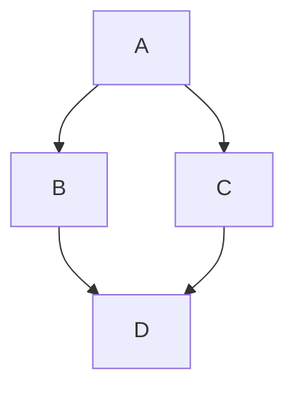
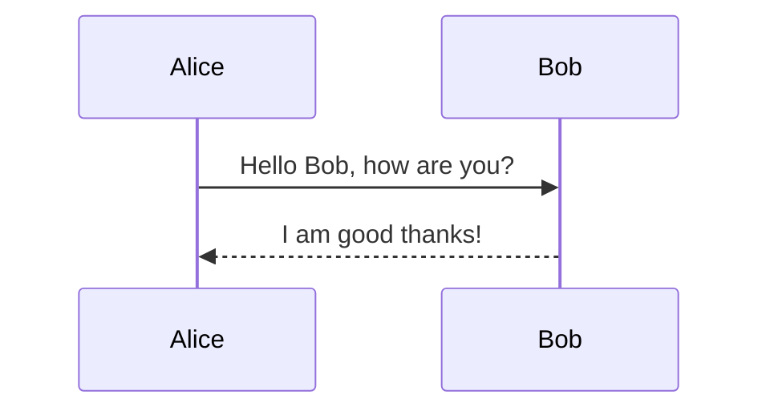

# smidir Content Creation Guide

`smidir` is a document generation tool that merges markdown files into a single ODT or PDF document using Pandoc and LibreOffice. This guide explains how to structure directories and write configuration files for `smidir`.

## Directory Structure

A directory is treated as a document or a document component if it contains a `content.yml` (or `content.yaml`) file.

```text
document_root/
  ├── content.yml      # Main entry point (required)
  ├── vars.yml         # Shared variables for this directory (optional)
  ├── section1.md      # Markdown content
  ├── section2.md
  └── sub_component/
      ├── content.yml
      └── page.md
```

## `content.yml`

The `content.yml` file defines the structure of the document segment.

### Required Keys
- `contents`: A list of items to include in the document. Items are processed in the order they appear.

### Optional Keys
- `vars`: A dictionary of variables that can be used in templates within this directory.
- Other keys (e.g., `title`, `version`) are treated as metadata and available in templates.

### Item Types in `contents`
1.  **Markdown File**: e.g., `section1.md`. Must end with `.md`.
2.  **Directory**: e.g., `sub_component/`. The tool will recursively look for `content.yml` in that directory.
3.  **Current Directory (`.`)**: Automatically includes all markdown files and relevant subdirectories (those with their own `content.yml`) in the current directory, sorted by name. 
    - It filters out: `content.yml`, `content.yaml`, `vars.yml`, `content.md`, `README.md`.

Example `content.yml`:
```yaml
title: My Document
version: "1.2"
vars:
  company: "Acme Corp"
contents:
  - intro.md
  - .
  - conclusion.md
```

## Variables and Templating

`smidir` supports two types of templating:
1.  **Jinja2-style**: `{{ variable_name }}` (Recommended).
2.  **Legacy style**: `${VARIABLE_NAME}` (Automatically converted to uppercase).

### Variable Precedence (Highest to Lowest)
1.  Command line `--vars-file`.
2.  `vars.yml` in the directory.
3.  `vars` dictionary in `content.yml`.
4.  Inherited from parent directory.

## Markdown Files

Markdown files can contain YAML frontmatter and template tags.

```markdown
---
title: Chapter 1
author: John Doe
---
# {{ title }}

Written by {{ author }} for {{ company }}.
```

## Mermaid Support

`smidir` supports Mermaid diagrams in markdown blocks. Use the `mermaid` class to trigger the filter.

### Basic Usage
```markdown

```

### Attributes
- `format`: `svg` (default) or `png`.
- `width`: Image width in the document (e.g., `800px`, `50%`, `10cm`). Defaults to `50%`.
- `png_width`: The width (in pixels) used when generating PNG images. Defaults to `800`. Use higher values (e.g., `3000`) for high-quality print output.

### Advanced Usage Example
```markdown

```

## Best Practices

- **Use `.` for large directories**: If you have many sections that should be merged in alphabetical order, use `contents: ["."]`.
- **Organize with subdirectories**: Use subdirectories with their own `content.yml` for complex documents.
- **Shared Variables**: Use `vars.yml` for variables shared across multiple markdown files in the same directory.
- **Naming**: Use numeric prefixes (e.g., `01-intro.md`, `02-body.md`) for predictable sorting when using `.`.
- **Mermaid Formats**: Use `svg` for most cases, but prefer `png` with high `png_width` for documents intended for professional printing.
- **Exclude Metadata**: Avoid putting sensitive info in `vars.yml` if the project is public.
