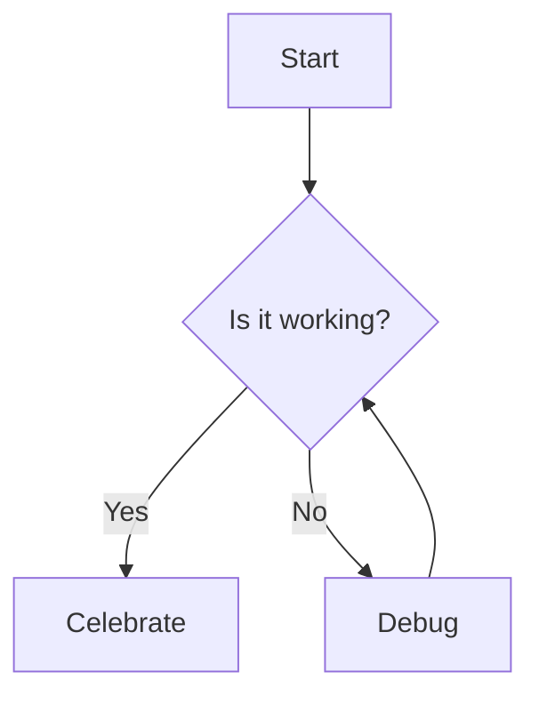

# Section 1: Mermaid Diagram

This section contains a Mermaid diagram to test the diagram generation feature.

\newpage

# Section 2: After Page Break

This section started after a page break. If the `pagebreak.lua` filter is working correctly, this header should appear on a new page in the generated ODT or PDF.

## Dynamic Content

The version of this document is {{ version }} and it was generated on {{ date }}.
